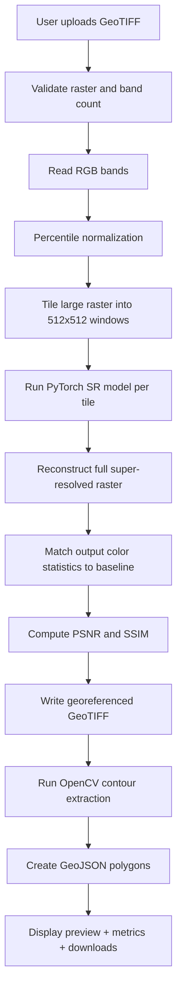
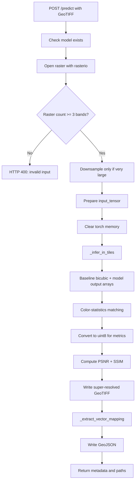
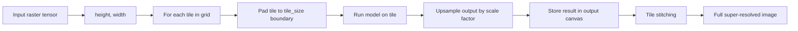
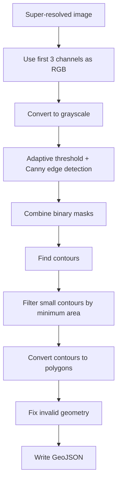
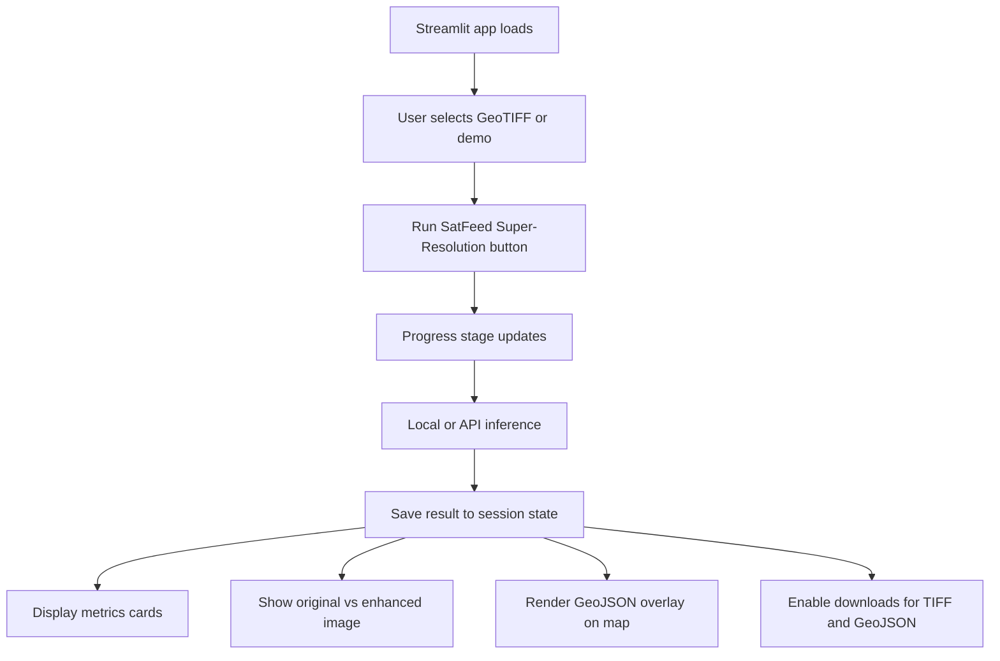
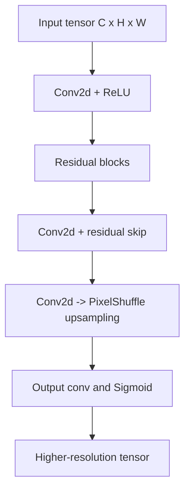
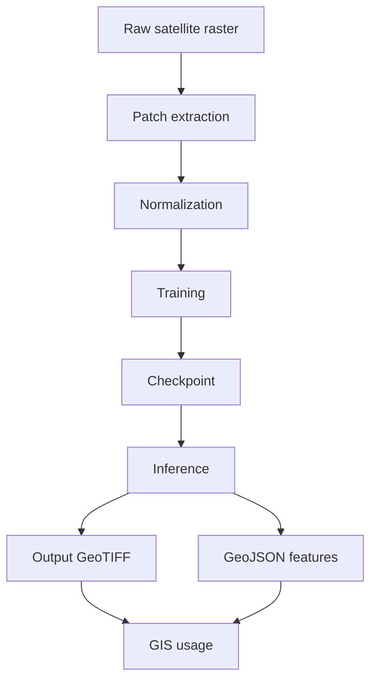
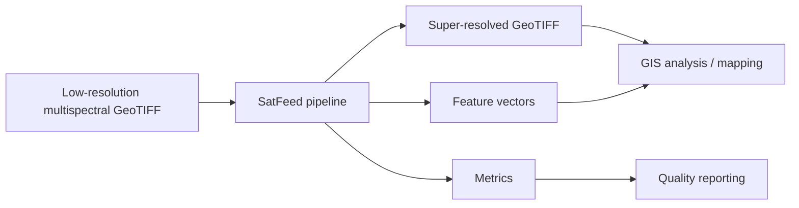

# SatFeed Flow Diagrams

This document shows the end-to-end flow of the SatFeed system: from raw GeoTIFF upload to enhanced output and GIS-ready vector extraction.

## 1) System-level end-to-end flow



## 2) Training flow

```mermaid
flowchart TD
    A[Pair LR and HR GeoTIFFs] --> B[Extract aligned patches]
    B --> C[Normalize band values to [0,1]]
    C --> D[Save archive as .npz]
    D --> E[Load dataset in train.py]
    E --> F[SatelliteSRNet forward pass]
    F --> G[Compute MSE loss]
    G --> H[Backprop + Adam optimizer]
    H --> I[Save checkpoint if loss improves]
    I --> J[best_model.pth]
```

## 3) Inference flow inside the API



## 4) Tile-based inference flow



## 5) Vector extraction flow



## 6) Dashboard flow



## 7) Model architecture flow



## 8) Data lifecycle



## 9) Complete operational summary



## Notes

- The system uses a 2x residual upscaling model in the training code and a 4x inference pipeline in the service layer.
- Large rasters are processed in tiles to avoid memory blowups.
- The model output is normalized and then converted to georeferenced output preserving source transform and CRS.
- The vector extraction stage is heuristic image processing rather than a learned segmentation model.
